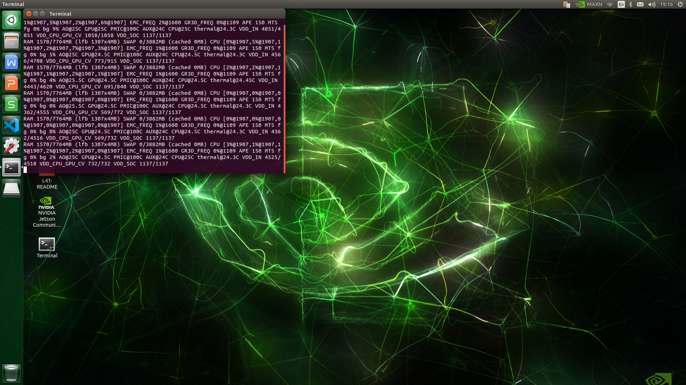

# XavierNXOverclock
Add Max-N Mode to Jetson Xavier NX

CPU 6-core @ 1900MHz

GPU @ 1100MHz

DLA 2-DLA @ 1100MHz

PVA @ 814MHz



```
sudo systemctl stop nvpmodel
sudo cp nvpmodel_t194_p3668.conf /etc/nvpmodel/nvpmodel_t194_p3668.conf
sudo systemctl start nvpmodel
sudo nvpmodel -m 0
```
